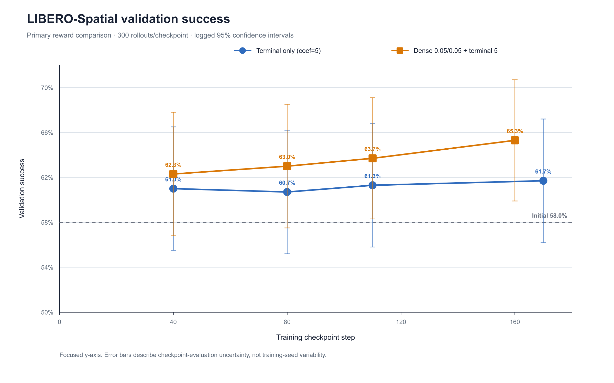
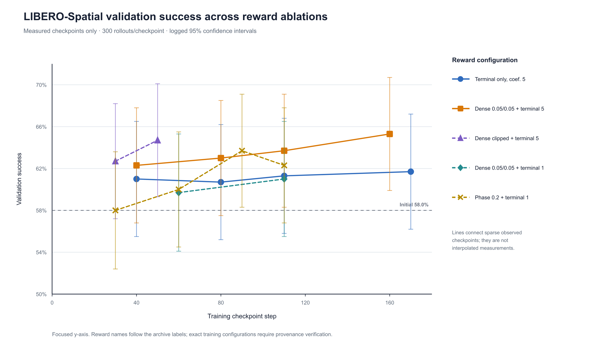
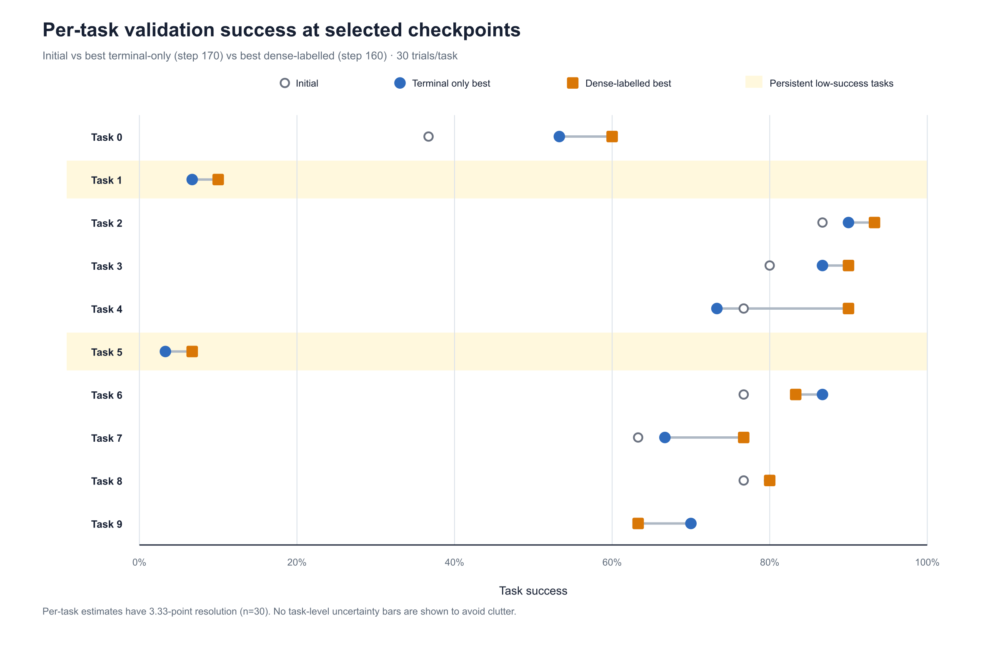

# Dense Subgoal Rewards for SimpleVLA-RL

This project extends [SimpleVLA-RL](https://github.com/PRIME-RL/SimpleVLA-RL) with optional phase-aware reward shaping for Vision-Language-Action reinforcement learning. The aim is to provide useful feedback before an episode reaches terminal success while preserving the original terminal-only training path as a reproducible control.

The current LIBERO-Spatial study starts from a weaker checkpoint with **58.0% validation success**. The best checkpoint labelled with dense progress and phase rewards reaches **65.3%**, compared with **61.7%** for the terminal-only coefficient-5 control. These are promising single-run observations rather than a final statistical claim.



## Project goal

Terminal success is well aligned with the manipulation objective, but it is sparse. A failed rollout receives the same outcome reward whether the robot never approaches the object or completes nearly the entire task. This makes credit assignment difficult when successful samples are uncommon, especially with small batches and limited rollout throughput.

The extension is designed to:

- decompose supported manipulation tasks into observable phases;
- measure continuous progress within a phase using online simulator state;
- track phases independently for every environment instance;
- reward only newly achieved progress rather than repeated motion;
- retain terminal success as the primary task objective;
- preserve the original SimpleVLA-RL behavior when dense reward is disabled;
- expose reward components for debugging and controlled ablations.

## Relationship to original SimpleVLA-RL

The original framework uses binary episode outcome as the verifier signal. With terminal coefficient \(\lambda\) and success indicator \(y\in\{0,1\}\), the sparse reward is

\[
r^{\mathrm{verifier}}=\lambda y.
\]

The control studied here uses \(\lambda=5\). Dense reward is an optional extension around that baseline, not a replacement for the model, rollout system, GRPO implementation, or LIBERO environment.

The published SimpleVLA-RL results are not used as a numerical baseline for this study. The original repository uses different starting checkpoints, compute, batch construction, and evaluation protocols. Here, “original method” means the terminal-only reward re-run from the same 0.580 checkpoint used by the dense-reward experiments.

## Method

### Five manipulation phases

Supported pick-and-place tasks are decomposed into:

1. reach the object;
2. grasp the object;
3. lift the object;
4. move the object toward the target;
5. place the object or reach environment success.

The current defaults use thresholds of 0.05 m for reaching, 0.06 m for target proximity, and 0.08 m for lifting. State extraction is best effort: missing object, target, or gripper state causes conservative behavior rather than silently inventing progress.

### Monotonic progress tracking

Every rollout environment owns an independent tracker. If \(p_t\in[0,1]\) is current phase progress, the rewarded increment is

\[
\Delta p_t^+=\max\left(p_t-\max_{\tau<t}p_\tau,0\right).
\]

Only improvement beyond the best previously reached progress produces a positive delta. Moving backward and returning to the same point therefore cannot repeatedly farm reward. Phase IDs also move monotonically forward.

### Reward composition

The dense module computes

\[
r_t^{\mathrm{shape}}=
\operatorname{clip}\left(
w_p\Delta p_t^+ + w_c c_t - w_s\lVert a_t-a_{t-1}\rVert_2,
-C,C
\right),
\]

where \(c_t\) is the number of completed phases and \(C\) is the dense-reward clip. An optional terminal component is added after clipping:

\[
r_t^{\mathrm{dense}}=r_t^{\mathrm{shape}}+w_Ty_t.
\]

The supported reward modes are:

| Mode | Training behavior |
|---|---|
| `log_only` | Compute and log subgoal metrics without changing the original reward. |
| `add` | Add the dense module output to the verifier reward. |
| `replace` | Replace the verifier reward with the dense module output. |

`log_only` is the safest mode for validating a new task rule. `add` is the primary shaping mode used by the current launcher.

### Important terminal-reward detail

The current base configuration sets `reward.subgoal.weights.terminal_success=1.0`. In `add` mode, this internal terminal component is added to the external verifier reward. With verifier coefficient 5, the effective successful-step reward can therefore contain both \(5y\) and \(1y\) unless the internal term is explicitly set to zero.

For shaping-only experiments, use:

```bash
reward.subgoal.weights.terminal_success=0.0
```

Every experiment should record this field explicitly.

## Mixed-outcome trajectory filtering

The trainer can filter a prompt group using the mean outcome of its `n_samples` rollouts. A group is retained when

\[
L \leq \frac{1}{n}\sum_{i=1}^{n}y_i \leq U.
\]

Bounds that exclude 0 and 1 retain only groups containing both successful and failed trajectories. This can provide informative within-group comparisons for GRPO, but it may require generating many extra rollouts before a training batch is filled.

This operation is different from clipping the numeric dense reward. The archive label `dense clipped` refers to trajectory selection according to the run-owner description; `clip_dense_reward` refers to bounding the shaping value.

## Optional task-aware sampling

The latest implementation also contains a task-balanced hard sampler. A configurable part of the batch provides rotating uniform task coverage; remaining samples are biased toward tasks with low exponentially smoothed validation success:

\[
q_k \propto 1-\operatorname{EMA}(s_k).
\]

This sampler is relevant because tasks 1 and 5 remain weak in the current results. It was introduced after the main ablations and is not claimed as part of the reported 65.3% result.

## Experimental setup

The main archive contains 16 evaluated checkpoints across five reward configurations.

| Item | Current study |
|---|---|
| Benchmark | LIBERO-Spatial |
| Model | OpenVLA-OFT |
| Adapter | LoRA rank 16, alpha 16, `llm-projector` |
| Initial validation success | 0.580 |
| Main validation size | 300 episodes/checkpoint |
| Per-task validation size | 30 episodes for each of 10 tasks |
| Primary metric | Mean binary episode success |
| Reported training compute | 2 NVIDIA L40 GPUs |

The two-GPU setting appears in the checkpoint-evaluation commands; the L40 hardware model comes from the run-owner documentation. The supplied archive does not include complete training-time hardware telemetry or Hydra configurations.

## Main results

| Reward configuration label | Best success | Best step | Gain over 0.580 | Last observed success |
|---|---:|---:|---:|---:|
| Terminal only, coefficient 5 | 0.617 | 170 | +0.037 | 0.617 |
| Dense 0.05/0.05 + terminal 5 | **0.653** | 160 | **+0.073** | **0.653** |
| Dense clipped + terminal 5 | 0.647 | 50 | +0.067 | 0.647 |
| Dense 0.05/0.05 + terminal 1 | 0.610 | 110 | +0.030 | 0.610 |
| Phase 0.2 + terminal 1 | 0.637 | 90 | +0.057 | 0.623 |

At the three checkpoint indices shared by terminal-only and the main dense-labelled run:

| Step | Terminal only | Dense-labelled | Difference |
|---:|---:|---:|---:|
| 40 | 0.610 | 0.623 | +0.013 |
| 80 | 0.607 | 0.630 | +0.023 |
| 110 | 0.613 | 0.637 | +0.024 |

The dense-labelled checkpoints are higher at all three aligned steps. Its observed sequence is monotonic:

```text
0.623 -> 0.630 -> 0.637 -> 0.653
```

The terminal-only sequence stays close to 61%:

```text
0.610 -> 0.607 -> 0.613 -> 0.617
```

This is evidence of a more consistently increasing measured curve, not proof of lower training variance. Only one apparent trajectory per condition is available.



## Per-task behavior

The best dense-labelled checkpoint is higher than the best terminal checkpoint on tasks 0–5 and 7, equal on task 8, and lower on tasks 6 and 9. The largest observed differences are:

- task 4: +16.7 percentage points;
- task 7: +10.0 points;
- task 0: +6.7 points;
- task 9: −6.7 points;
- task 6: −3.4 points.

Tasks 1 and 5 remain the main bottlenecks. Their initial success is 10.0% and 3.3%; at the best dense-labelled checkpoint it is 10.0% and 6.7%.



Each per-task estimate uses only 30 trials and changes in increments of 3.33 points. The task plot is diagnostic rather than a task-level significance test.

## Interpretation

The current results are consistent with three working hypotheses:

1. Intermediate phase-aware feedback can improve optimization when terminal successes are too sparse to provide frequent differentiation.
2. Dense shaping works best when it remains anchored to a strong completion objective.
3. Aggregate reward design alone does not solve tasks that begin with almost no successful behavior; those tasks may require targeted sampling or better task-specific progress rules.

The mixed-outcome filtered run reaches 64.7% by checkpoint 50, showing no obvious global collapse. However, the run-owner reports similar wall-clock duration to much longer unfiltered runs. Checkpoint step is therefore not a valid measure of environment-sample efficiency or compute efficiency by itself.

## Statistical and provenance limitations

The checkpoint-level 95% confidence half-width logged for the main evaluations is approximately 5.4–5.6 percentage points. These intervals overlap substantially. They describe uncertainty from 300 evaluation episodes and do not include training-seed variability.

The following limitations must remain visible when these results are reported:

- no repeated training seeds are included;
- conditions have unequal checkpoint counts and endpoints;
- “best checkpoint” selection is post hoc;
- episode-level paired outcomes were not retained;
- the 0.580 initial baseline is present as CSV data but its raw log is absent;
- full training commands and Hydra configurations are absent;
- checkpoint paths for the run labelled `Dense 0.05/0.05 + terminal 5` include names such as `dense_02_03` and `dense_03_02` across different directories;
- the internal dense terminal weight may duplicate part of the verifier reward;
- generated rollouts, retained rollouts, environment transitions, GPU-hours, and wall-clock time are not fully recorded;
- the current evaluation covers LIBERO-Spatial only.

The success measurements themselves were checked: all 16 rows in the summary CSV match the final aggregate and per-task metrics in their corresponding raw logs. The uncertainty concerns training provenance and generalization, not transcription of the validation values.

## Repository map

Core reward implementation:

- `verl/utils/subgoal_reward/libero_state.py` — simulator-state extraction;
- `verl/utils/subgoal_reward/phases.py` — progress functions and completion thresholds;
- `verl/utils/subgoal_reward/task_specs.py` — supported task inference;
- `verl/utils/subgoal_reward/tracker.py` — per-environment monotonic phase tracking;
- `verl/utils/subgoal_reward/dense_reward.py` — reward composition and clipping;
- `verl/utils/subgoal_reward/engine.py` — configuration and rollout-facing interface.

Training integration:

- `verl/workers/rollout/rob_rollout.py` — reward computation during environment interaction;
- `verl/trainer/main_ppo.py` — verifier and dense-reward combination;
- `verl/trainer/ppo/ray_trainer.py` — filtering, validation, and sampler updates;
- `verl/utils/dataset/rob_dataset.py` — task-balanced hard sampler;
- `verl/trainer/config/ppo_trainer.yaml` — default configuration;
- `examples/run_openvla_oft_rl_libero_lora_dense.sh` — dense LoRA launcher.

Analysis and paper artifacts:

- [`reports/dense_reward_small_batch_study_prism.md`](reports/dense_reward_small_batch_study_prism.md) — full technical and statistical report;
- [`reports/validation_audit.json`](reports/validation_audit.json) — machine-readable audited results;
- [`reports/analyze_validation_results.py`](reports/analyze_validation_results.py) — reproducible log parser;
- [`reports/figures/README.md`](reports/figures/README.md) — paper figure guide and captions;
- `reports/figures/paper/` — SVG, PDF, and PNG figures.

## Running the baseline

The baseline path remains unchanged when dense reward is disabled:

```bash
bash examples/run_openvla_oft_rl_libero_lora.sh \
  reward.subgoal.enabled=False
```

This is the control configuration for reward comparisons.

## Logging subgoals without changing training

Use `log_only` before training with a new task rule:

```bash
bash examples/run_openvla_oft_rl_libero_lora_dense.sh \
  reward.subgoal.enabled=True \
  reward.subgoal.mode=log_only \
  reward.subgoal.log=True
```

Confirm that `subgoal_positive_delta`, `phase_completed`, and the individual reward components are nonzero where expected.

## Running additive dense shaping

A shaping-only additive configuration can be launched with explicit terminal handling:

```bash
bash examples/run_openvla_oft_rl_libero_lora_dense.sh \
  reward.subgoal.enabled=True \
  reward.subgoal.mode=add \
  reward.subgoal.weights.subgoal_progress=0.05 \
  reward.subgoal.weights.phase_transition=0.05 \
  reward.subgoal.weights.terminal_success=0.0 \
  reward.subgoal.clip_dense_reward=0.05
```

This example makes the dense module shaping-only while leaving terminal success to the external verifier. It is a recommended clean configuration, not a reconstruction of the unverified commands that produced every archived checkpoint.

## Validation

Evaluate a LoRA checkpoint with the repository validation script:

```bash
TARGET_ROLLOUTS=300 SAVE_VIDEO=False \
bash examples/validate_openvla_oft_rl_libero_lora_checkpoint.sh \
  /path/to/checkpoint/lora_adapter \
  validation-experiment-name
```

For paper-quality comparisons, keep the task set, trial seeds, rollout count, normalization key, checkpoint-selection rule, and validation code revision fixed.

## Reproducing the analysis and figures

After extracting the validation archive:

```bash
python3 reports/analyze_validation_results.py \
  /path/to/validation_results \
  --output reports/validation_audit.json

python3 reports/figures/generate_paper_figures.py
```

The figure generator writes SVG, PDF, and PNG outputs to `reports/figures/paper/`.

## Recommended next experiments

1. Recover the exact training Hydra configuration for every archived checkpoint.
2. Repeat terminal-only and the selected dense configuration with at least three matched random seeds.
3. Save episode-level task ID, trial seed, and success for paired evaluation.
4. Report environment episodes, retained groups, transitions, GPU-hours, and wall-clock time.
5. Compare terminal coefficients 1 and 5 while holding dense weights and filtering fixed.
6. Set the internal dense terminal weight explicitly to 0 or 1 in every run.
7. Compare mixed-outcome filtering under matched generated-rollout budgets.
8. Test task-balanced hard sampling on tasks 1 and 5 with a uniform-sampling control.
9. Extend evaluation to another LIBERO suite and, if compute permits, a smaller VLA such as SmolVLA.

## Current conclusion

The dense-reward extension provides an interpretable online signal for partial manipulation progress while preserving the original terminal-only path. In the current weaker-checkpoint study, the best dense-labelled checkpoint reaches 65.3%, compared with 61.7% for terminal-only and 58.0% before RL. The advantage appears at every aligned measured checkpoint, but uncertainty, single-seed training, and incomplete configuration provenance prevent a definitive superiority or sample-efficiency claim. The immediate priority is controlled replication with exact configs, matched seeds, and complete rollout accounting.

## References

- Li et al., [“SimpleVLA-RL: Scaling VLA Training via Reinforcement Learning”](https://arxiv.org/abs/2509.09674), 2025.
- [PRIME-RL/SimpleVLA-RL](https://github.com/PRIME-RL/SimpleVLA-RL).
- Ng, Harada, and Russell, [“Policy Invariance Under Reward Transformations: Theory and Application to Reward Shaping”](https://dl.acm.org/doi/10.5555/645528.657613), ICML 1999.
