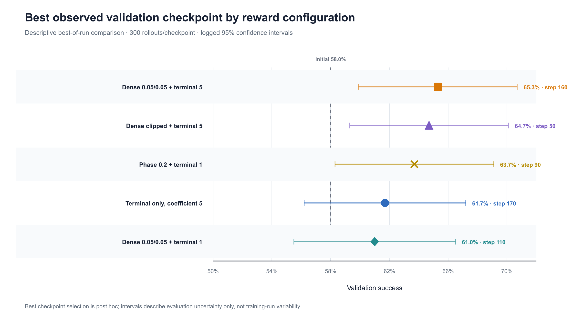
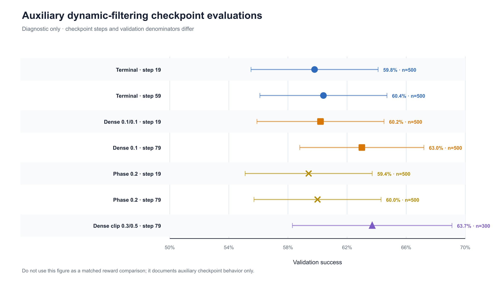

# Current Dense-Reward Validation Results

## Technical summary

The current LIBERO-Spatial validation archive starts from an initial success rate of 0.580. The best checkpoint labelled `Dense 0.05/0.05 + terminal 5` reaches 0.653, while the best terminal-only coefficient-5 checkpoint reaches 0.617. The observed best-checkpoint difference is therefore **+0.036 absolute success rate, or +3.6 percentage points**, in favor of the dense-labelled run.

At the three checkpoint indices shared by the main dense-labelled and terminal-only curves, the dense-labelled checkpoints are higher by 1.3, 2.3, and 2.4 percentage points. Its measured curve is also monotonic over the four available checkpoints. This supports the descriptive conclusion that dense shaping produced a stronger validation trajectory in this run. It does not establish lower training variance, statistical superiority, or sample efficiency because only one training trajectory per condition is available and the archive lacks full rollout and compute accounting.


## Data and version provenance

| Item | Audited value |
|---|---|
| Source archive | `validation_results.zip` |
| Archive SHA-256 | `da5b7edf1d8902b59b923a3916c2439d79b4800804984a3b8494a4e4afd8a801` |
| Archive modification time | 2026-08-23 18:58:43 −03:00 |
| Audit date | 2026-08-26 |
| Main raw validation logs | 16 |
| Main summary rows | 16 |
| Raw-log/summary disagreements | 0 |
| Additional dynamic-run logs | 7 |
| Checked-out code revision | `a4bf9b1` |
| Newer upstream revision inspected | `origin/main` at `1b5fc6c` |

The numerical audit was regenerated from a fresh extraction of the attached archive. The resulting machine-readable output was byte-identical to [`reports/validation_audit.json`](reports/validation_audit.json). The ZIP member paths were also checked for absolute paths and parent-directory traversal; none were found.

The validation archive does not contain the complete Hydra configuration or training command for every checkpoint. Run names are therefore preserved as labels rather than treated as independently verified hyperparameters.

## Evaluation protocol and metric

- Benchmark: LIBERO-Spatial.
- Primary metric: mean binary episode success.
- Main evaluation: 300 rollouts per checkpoint.
- Task allocation: 30 rollouts for each of 10 tasks.
- Initial checkpoint: 0.580 aggregate success.
- Logged uncertainty: normal-approximation 95% confidence half-width, approximately 0.054–0.056 for the 300-rollout evaluations.

The 0.580 initial value is supplied as a standalone CSV distribution rather than a raw validation log. Alternative plots in a `starting_585` directory are not used: the audited main data and current experiment description identify 0.580 as the study baseline.

## Complete main checkpoint results

All success values below were reconciled against both the summary CSV and the final aggregate values in their raw logs.

| Reward configuration label | Step | Success | 95% half-width | Gain over 0.580 |
|---|---:|---:|---:|---:|
| Terminal only, coefficient 5 | 40 | 0.610 | 0.055 | +0.030 |
| Terminal only, coefficient 5 | 80 | 0.607 | 0.055 | +0.027 |
| Terminal only, coefficient 5 | 110 | 0.613 | 0.055 | +0.033 |
| Terminal only, coefficient 5 | 170 | **0.617** | 0.055 | **+0.037** |
| Dense 0.05/0.05 + terminal 5 | 40 | 0.623 | 0.055 | +0.043 |
| Dense 0.05/0.05 + terminal 5 | 80 | 0.630 | 0.055 | +0.050 |
| Dense 0.05/0.05 + terminal 5 | 110 | 0.637 | 0.054 | +0.057 |
| Dense 0.05/0.05 + terminal 5 | 160 | **0.653** | 0.054 | **+0.073** |
| Dense clipped + terminal 5 | 30 | 0.627 | 0.055 | +0.047 |
| Dense clipped + terminal 5 | 50 | **0.647** | 0.054 | **+0.067** |
| Dense 0.05/0.05 + terminal 1 | 60 | 0.597 | 0.056 | +0.017 |
| Dense 0.05/0.05 + terminal 1 | 110 | **0.610** | 0.055 | **+0.030** |
| Phase 0.2 + terminal 1 | 30 | 0.580 | 0.056 | +0.000 |
| Phase 0.2 + terminal 1 | 60 | 0.600 | 0.055 | +0.020 |
| Phase 0.2 + terminal 1 | 90 | **0.637** | 0.054 | **+0.057** |
| Phase 0.2 + terminal 1 | 110 | 0.623 | 0.055 | +0.043 |


## Primary comparison: terminal-only versus dense-labelled

### Shared checkpoint indices

| Step | Terminal only | Dense-labelled | Dense minus terminal |
|---:|---:|---:|---:|
| 40 | 0.610 | 0.623 | +0.013 |
| 80 | 0.607 | 0.630 | +0.023 |
| 110 | 0.613 | 0.637 | +0.024 |
| Mean difference | — | — | **+0.020** |

The terminal-only sequence is `0.610 → 0.607 → 0.613 → 0.617`. The main dense-labelled sequence is `0.623 → 0.630 → 0.637 → 0.653`. Thus, the dense-labelled value is higher at every aligned measured step, and its four recorded values rise monotonically.

### Best-checkpoint comparison

| Quantity | Value |
|---|---:|
| Initial success | 0.580 |
| Best terminal-only success | 0.617 |
| Best dense-labelled success | 0.653 |
| Dense minus terminal | +0.036 |
| Terminal gain over initial | +0.037 |
| Dense gain over initial | +0.073 |

The dense gain from the starting checkpoint is 97.3% larger than the terminal-only gain when computed as ((0.073/0.037)-1). This is a descriptive ratio of gains, not a 97.3% improvement in success rate. Relative to the best terminal success rate itself, the dense best is 5.8% higher: (0.653/0.617-1). For clarity, the paper should lead with the least ambiguous effect size: **+3.6 percentage points**.

The colleague’s approximate “30%” description is not directly reproduced by any primary comparison above. It should not be used without defining its denominator and checkpoint window.



## Ablation review

### Dense 0.05/0.05 + terminal 5

This is the strongest observed main run: 0.623 at step 40 and 0.653 at step 160. It exceeds terminal-only at all three aligned steps and has the highest best checkpoint in the main archive. The result is consistent with dense progress and phase feedback helping optimization while a strong terminal objective remains present.

The exact `0.05/0.05` training settings are not recoverable from the archive alone. They originate from the archive label and run-owner description; checkpoint path fragments such as `dense_02_03` and `dense_03_02` create unresolved configuration provenance.

### Dense clipped + terminal 5

The mixed-outcome filtered run increases from 0.627 at step 30 to 0.647 at step 50. According to the run-owner description, training retains groups that are neither entirely successful nor entirely failed. This is trajectory selection, not numeric clipping of the dense reward.

The high value at an early checkpoint is encouraging, but checkpoint step is not an environment-sample or compute budget. The run owner reports that this 50-step run took roughly as long in wall-clock time as 160-step runs because filtering rejected many rollout groups. Without generated-rollout counts, retained-rollout counts, transitions, GPU-hours, and wall-clock logs, no sample-efficiency or compute-efficiency conclusion is justified.

### Dense 0.05/0.05 + terminal 1

This weaker-terminal run reaches 0.610, below the 0.617 terminal coefficient-5 control and 0.653 dense-plus-terminal-5 run. It is consistent with the hypothesis that dense shaping benefits from a sufficiently strong completion objective, but the ablation is not factorial: terminal coefficient, possible internal terminal reward, and other unrecovered run settings may differ.

### Phase 0.2 + terminal 1

The phase-only-labelled run rises to 0.637 at step 90 and then falls to 0.623 at step 110. Its best value is competitive with the main dense run at step 110, but the curve is not monotonic. The archive label and run-owner note do not fully agree about the effective reward magnitude: the note says a reward clip was not increased. This condition must therefore be described by its label and behavior, not as a fully verified `0.2` phase reward implementation.

## Per-task analysis

The table compares the initial checkpoint, the best terminal checkpoint at step 170, and the best dense-labelled checkpoint at step 160. Each task estimate is based on only 30 episodes and therefore moves in increments of about 0.033.

| Task | Initial | Best terminal | Best dense | Dense minus terminal |
|---:|---:|---:|---:|---:|
| 0 | 0.367 | 0.533 | 0.600 | +0.067 |
| 1 | 0.100 | 0.067 | 0.100 | +0.033 |
| 2 | 0.867 | 0.900 | 0.933 | +0.033 |
| 3 | 0.800 | 0.867 | 0.900 | +0.033 |
| 4 | 0.767 | 0.733 | 0.900 | +0.167 |
| 5 | 0.033 | 0.033 | 0.067 | +0.034 |
| 6 | 0.767 | 0.867 | 0.833 | −0.034 |
| 7 | 0.633 | 0.667 | 0.767 | +0.100 |
| 8 | 0.767 | 0.800 | 0.800 | +0.000 |
| 9 | 0.700 | 0.700 | 0.633 | −0.067 |

The largest favorable differences occur on tasks 4 (+16.7 points), 7 (+10.0), and 0 (+6.7). Dense is lower on tasks 6 (−3.4) and 9 (−6.7). Tasks 1 and 5 remain the clearest bottlenecks: even the best dense checkpoint reaches only 0.100 and 0.067.


These task-level values are diagnostic. With only 30 episodes per task and no paired episode outcomes, they should not be presented as task-level significance tests.

## Additional dynamic-run results

The archive contains seven logs under `trainings_with_dynamic_clip`. They are reported separately because they use a mixture of 300- and 500-rollout evaluations, do not form a complete matched design, and are not part of the 16-row main summary.

| File-derived condition | Step | Rollouts | Success | 95% half-width |
|---|---:|---:|---:|---:|
| Terminal | 19 | 500 | 0.598 | 0.043 |
| Terminal | 59 | 500 | 0.604 | 0.043 |
| Dense 0.1/0.1 | 19 | 500 | 0.602 | 0.043 |
| Dense 0.1 | 79 | 500 | 0.630 | 0.042 |
| Phase 0.2 | 19 | 500 | 0.594 | 0.043 |
| Phase 0.2 | 79 | 500 | 0.600 | 0.043 |
| Dense clip 0.3/0.5 | 79 | 300 | 0.637 | 0.054 |



The accompanying `summary.tsv` is malformed: values that behave like rollout counts appear in its accuracy column, and the rollout-count field is blank. The table above is therefore reconstructed from the raw log aggregates, not from that TSV.

## Statistical uncertainty and robustness

The reported checkpoint confidence intervals overlap substantially. A conservative unpaired normal approximation using the rounded aggregate rates gives:

- best dense versus best terminal: difference 0.036, approximate 95% interval [−0.041, 0.113], two-sided p ≈ 0.359;
- best dense versus initial: difference 0.073, approximate 95% interval [−0.005, 0.151], two-sided p ≈ 0.065.

These calculations are sensitivity checks, not the preferred analysis. If the same validation episodes or seeds were used across checkpoints, a paired comparison would be more efficient, but episode-level paired outcomes were not retained. Best-checkpoint selection is also post hoc, so a test on the selected maxima would require a predeclared selection rule or independent final evaluation.

The current evidence supports an observed-run comparison. It does not estimate training-seed variance because no repeated training seeds are available.

## Consistency with the repository implementation

The checked-out revision `a4bf9b1` implements the following mechanism:

- five monotonic pick-and-place phases;
- positive progress increments beyond the best previous phase progress;
- phase-completion rewards;
- optional action-smoothness penalty;
- clipping of the shaping component before adding the dense module’s internal terminal component;
- `log_only`, `add`, and `replace` integration modes;
- mixed-outcome group filtering in the trainer.

Its base configuration defaults to progress weight 0.2, phase-transition weight 0.05, internal terminal-success weight 1.0, and dense shaping clip 0.05. The dense launcher enables `add` mode and inherits those defaults unless explicit Hydra overrides are supplied. In `add` mode, a nonzero internal dense terminal weight is added to the external verifier reward, so a nominal external terminal coefficient of 5 can coexist with an additional internal terminal reward of 1.

These code defaults explain the available implementation, not necessarily the exact archived training runs. Exact run-level configs are missing and should be recovered before the method table in a paper is finalized.

The task-balanced hard sampler exists in the newer `origin/main` revision `1b5fc6c`, not in the checked-out revision `a4bf9b1`. It was not used to produce the reported 0.653 result and must not be described as part of that experiment.

## Defensible paper claims

The current evidence supports the following wording:

> Starting from 58.0% validation success on LIBERO-Spatial, the best dense-reward-labelled checkpoint reached 65.3%, compared with 61.7% for the terminal-only coefficient-5 control. The dense-labelled run was higher at all three aligned measured checkpoints, by 1.3–2.4 percentage points, and produced a monotonic measured validation trajectory. These single-run results motivate controlled multi-seed evaluation but do not by themselves establish statistical superiority or sample efficiency.

The following claims are not supported by the current archive:

- “dense reward is statistically significantly better”;
- “dense reward is 30% better” without a defined denominator;
- “dense reward reduces training variance”;
- “the clipped run is more sample-efficient”;
- “the exact archived reward weights are proven by the current config defaults”;
- “the task-aware sampler contributed to the 65.3% result”;
- “the result generalizes beyond LIBERO-Spatial.”

## Reproduction artifacts

- [`reports/analyze_validation_results.py`](reports/analyze_validation_results.py): raw-log parser and consistency checks.
- [`reports/validation_audit.json`](reports/validation_audit.json): machine-readable audit.
- [`reports/dense_reward_small_batch_study_prism.md`](reports/dense_reward_small_batch_study_prism.md): longer Prism-ready technical report.
- [`reports/figures/README.md`](reports/figures/README.md): figure descriptions and captions.
- [`reports/figures/paper/`](reports/figures/paper/): SVG, PDF, and PNG figure exports.

To regenerate the audit after extracting the archive:

```bash
python3 reports/analyze_validation_results.py \
  /path/to/validation_results \
  --output reports/validation_audit.json
```

## Required next experiments

1. Recover and archive the exact Hydra configuration, code commit, seed, and checkpoint provenance for every condition.
2. Repeat terminal-only and the selected dense configuration with at least three matched training seeds.
3. Predeclare a final-checkpoint or checkpoint-selection rule and evaluate the selected model on an independent episode set.
4. Save episode-level task ID, validation seed, success, and checkpoint ID to enable paired analysis.
5. Record generated rollouts, retained groups, environment transitions, wall-clock time, and GPU-hours.
6. Compare terminal coefficients 1 and 5 while holding dense weights, filtering, sampling, and compute fixed.
7. Compare mixed-outcome filtering under a matched generated-rollout budget.
8. Evaluate the newer task-aware sampler separately, with a uniform-sampling control and explicit focus on tasks 1 and 5.
9. Extend the experiment to at least one additional LIBERO suite.

## Conclusion

The newest audited results show a clear descriptive advantage for the main dense-labelled run: 65.3% best validation success versus 61.7% for terminal-only from the same 58.0% starting checkpoint. The dense curve is higher at all aligned measured steps and rises monotonically across its recorded checkpoints. The strongest scientifically defensible conclusion is therefore that phase-aware dense shaping is promising under the tested small-batch regime. Multi-seed training, exact configuration recovery, independent checkpoint evaluation, and complete compute accounting remain necessary before making a definitive performance or efficiency claim.
